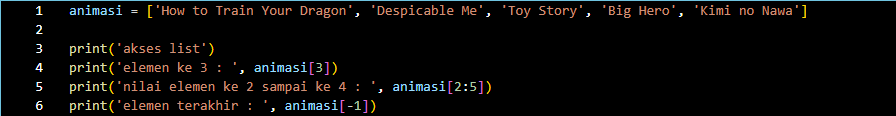
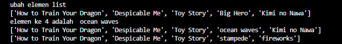
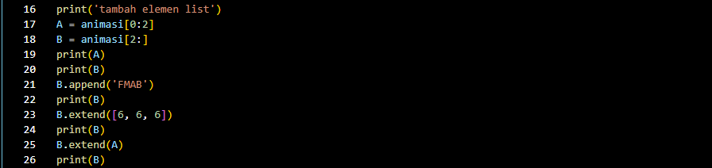
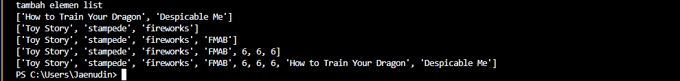
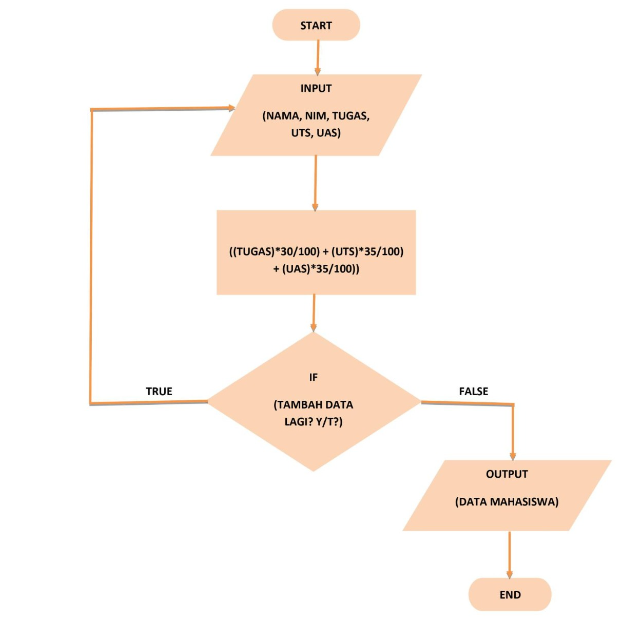
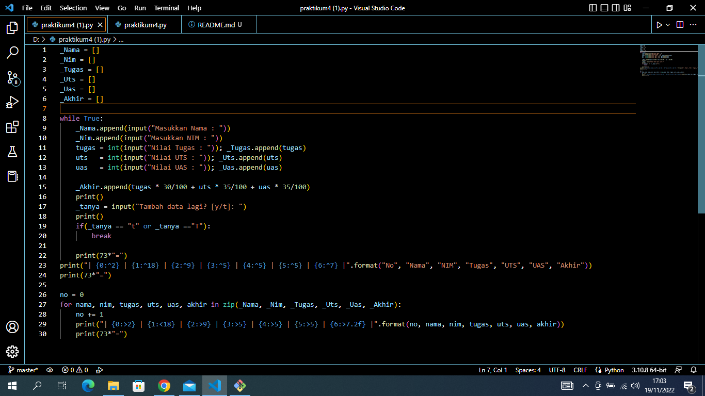

# pertemuan9 

## Buat sebuah list sebanyak 5 elemen dengan nilai bebas

# tampilkan elemen ke 3
# Ambil nilai elemen ke-2 sampai elemen ke-4
# Ambil elemen terakhi
  
## program



## penjelasan
1.Membuat list dengan nilai yang diinginkan
```
animasi = ['How to Train Your Dragon', 'Despicable Me', 'Toy Story', 'Big Hero', 'Kimi no Nawa']
```

2.Menampilakn semua elemen yang terdapat pada list diatas
```
print('akses list')
print('elemen ke 3 : ', animasi[3])
```

3.Jika ingin mengambil elemen ke-2 sampai elemen ke-4 dapat menggunakan

print('nilai elemen ke 2 sampai ke 4 : ', animasi[2:5])
print('elemen terakhir : ', animasi[-1])

4.Jika ingin mengambil elemen terakhir dapat menggunakan
```
print('elemen terakhir : ', animasi[-1])
```
## output



## Mengubah Elemen List

Ubah elemen ke-4 dengan nilai lainnya
Ubah elemen ke-4 sampai dengan elemen terakhir


# penjelasan

1.Membuat list dengan nilai yang diinginkan

print('ubah elemen list')
print(animasi)
animasi[3] = 'ocean waves'
```

2.jika ingin mengubah elemen ke 4 dapat menggunakan `animasi[3] = 'ocean waves'`
```
print('elemen ke 4 adalah ', animasi[3])
```
3.jika ingin mengubah elemen ke 4 sampai dengan elemen terakhir  dapat menggunakan `animasi[3:] = 'stampede', 'fireworks' `
```
print(animasi)


## Menambahkan Elemen List

=> Ambil 2 bagian dari list pertama (A) dan jadikan list ke-2 (B)
=>Tambah list B dengan nilai string
=>Tambah list B dengan 3 nilai
=>Gabungkan list B dengan list A

## program



# penjelasan

1.Membuat list dengan variabel a dan b
```
A = animasi[0:2]
B = animasi[2:]
```

2.Untuk mengambil 2 bagian dari list a dan dijadikan list b
```
print(A)
print(B)
```

3.Untuk menambahkan list b dengan nilai string
```
B.append('FMAB')
```
4.Untuk menambahkan list b dengan 3 nilai
```
print(B)
B.extend([6, 6, 6])
```
5.Untuk menggabungkan list b dengan list a
```
B.extend(A)
print(B)
```

## Output


## TUGAS PRATIKUM

Program sederhana untuk menambahkan data kedalam sebuat list





# Penjelasan
1.Mendeklarasi list
```
_nama = []
_nim = []
_tugas = []
_uts = []
_uas = []
_akhir = []
```

2.Gunakan perulangan while loop dengan nilai "True"
```
while True:
```

3.Menginput nama, nim, tugas, uts, uas, dan akhir dengan menambahkan method .append
```
 _nama.append(input("Masukan nama : "))
    _nim.append(input("Masukan NIM  : "))
    tugas = int(input("Nilai tugas  : ")); _tugas.append(tugas)
    uts   = int(input("Nilai UTS    : ")); _uts.append(uts)
    uas   = int(input("Nilai UAS    : ")); _uas.append(uas)

    _akhir.append(tugas * 30/100 + uts * 35/100 + uas * 35/100)
```

4.Pada input Tambah Data Lagi? apabila jawaban “t” atau “T”, maka program akan berhenti dan akan menampilkan hasil daftar datanya
```
_tanya = input("Tambah data lagi? [y/t]: ")
    print()
    if(_tanya == "t" or _tanya =="T"):
        break
```

5.Untuk membuat header table, menggunakan print(73*"="), fungsinya membuat "=" sebanyak 73 sebagai garis, dan menggunakan format string
```
print(73*"=")
print("| {0:^2} | {1:^18} | {2:^9} | {3:^5} | {4:^5} | {5:^5} | {6:^7} |".format("No", "Nama", "NIM", "Tugas", "UTS", "UAS", "Akhir"))
print(73*"=")
```

6.Deklarasi no = 0 untuk membuat nomor pada isi table, lalu membuat perulangan dengan for

=> Perulangan nama, nim, tugas, uts, uas, sesuai urutan yang ada di dalam zip
=> Pada list yang dimaksud, in zip berfungsi untuk membungkus semua list
```
no = 0
for nama, nim, tugas, uts, uas, akhir in zip(_nama, _nim, _tugas, _uts, _uas, _akhir):
```

7.Membuat isi tabel sesuai keinginan dengan format string

```
no += 1    
    print("| {0:>2} | {1:<18} | {2:>9} | {3:>5} | {4:>5} | {5:>5} | {6:>7.2f} |".format(no, nama, nim, tugas, uts, uas, akhir))
```

8.Untuk membuat footer atau garis paling bawa ketika looping isi table selesai

```
print(73*"=")
```

## Output


